# Vokabeltrainer


## Aufgabenstellung

Fachübergreifend soll ein Informationssystem individuell oder
in 2er-Gruppenentwickeltwerden. Mittels einer
Webapplikation sollen wesentliche Informationen für eine
Anwendungsdomäne verwaltet werden können. Dazu erfolgt
die Speicherung im Backend in einer relationalen Datenbank.

## Projektszenario

### Thema
Das Thema unseres Projektes ist ein Vokabeltrainer mit Lern- und Prüfmodus. 

## Spezifikation

### Beschreibung
Wir haben uns für ein Vokabellernsystem mit Lernkarten und Kartendecks entschieden. Es gib einen
„Login“ mittels eines Usernamens. Das Teilen von Kartendecks an andere User ist ebenso möglich. Zu
jeder Lernkarte werden Userstatistiken angelegt, um den Lernfortschritt beobachten zu können.

### Mock-Ups

**Start Page:**

&nbsp;
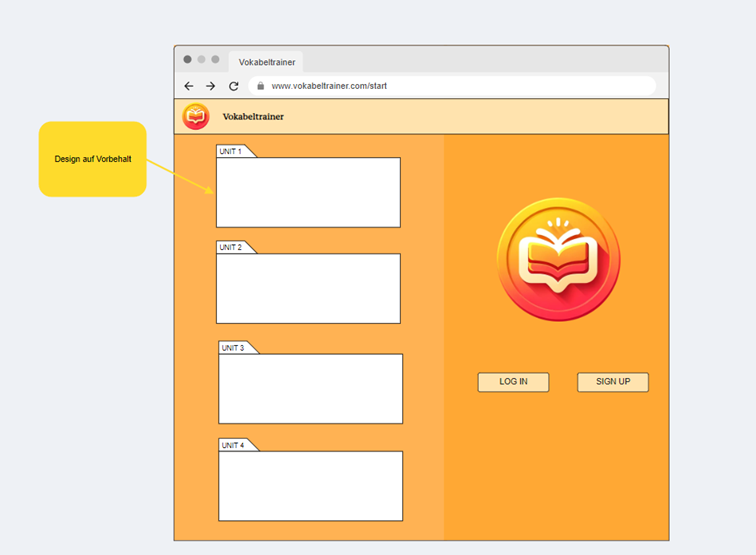

&nbsp;
**Login Page:**

&nbsp;
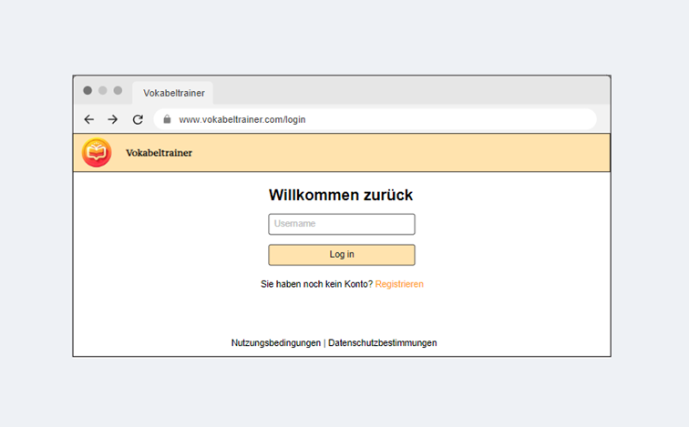

&nbsp;
**Sign-Up Page:**

&nbsp;
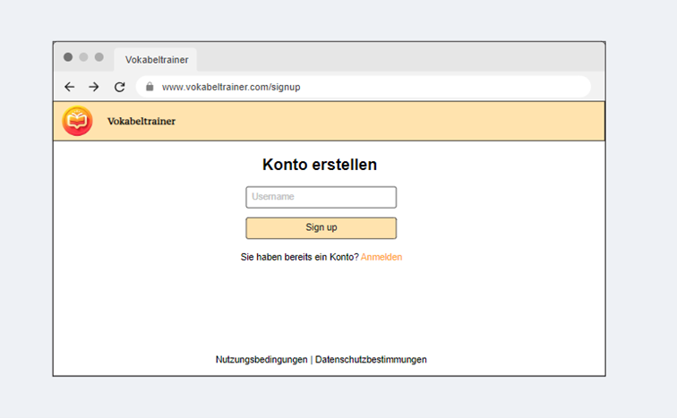

&nbsp;
**Main Page:**

&nbsp;
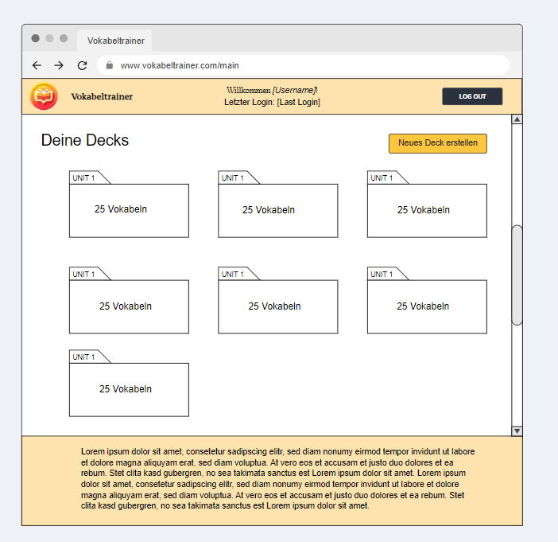

&nbsp;
**Seite zum Erstellen eines Decks und con Flashcard:**

&nbsp;
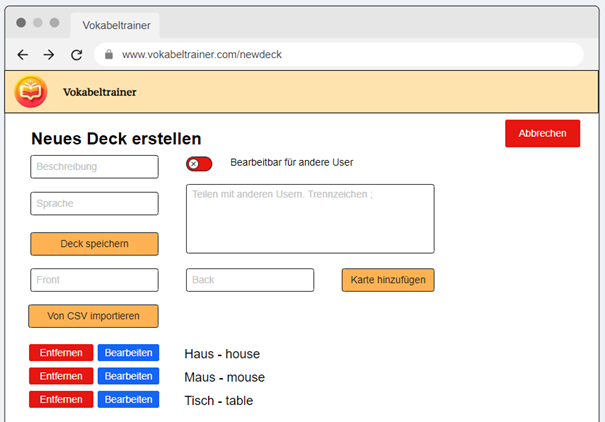

&nbsp;
**Beispiel für das bearbeiten eines Decks mit Flashcard:**

&nbsp;
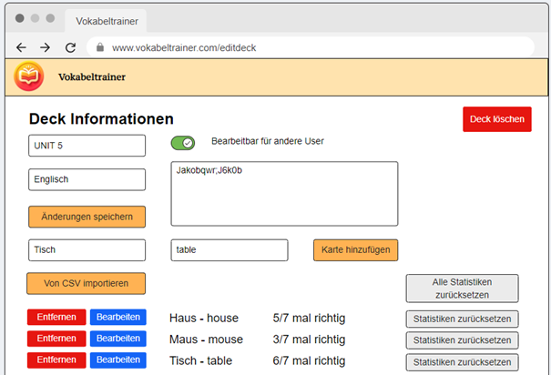

&nbsp;
**Lernmodus:**

&nbsp;
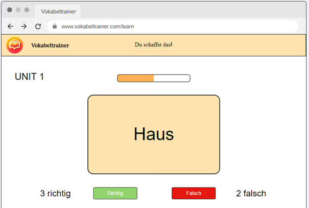

&nbsp;
**Testmodus:**

&nbsp;
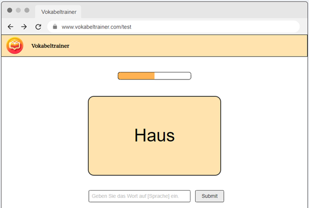

&nbsp;
**Testmodus Ergebnis:**

&nbsp;
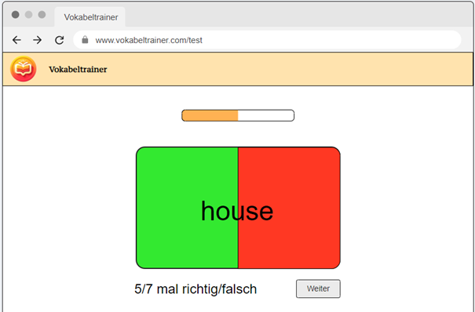

### Relationsschreibweise

&nbsp;
User(id, username, registrationDate, lastLogin, deleteTag)

&nbsp;
Deck(id, description, language, owner, editable)

&nbsp;
Access (userId -> User, deckId -> Deck)

&nbsp;
Flashcard(id, Front, Back, deckId -> Deck)

&nbsp;
UserFlashCardStats(shown, correct, userId -> User, cardId -> Card)

## ER-Modell

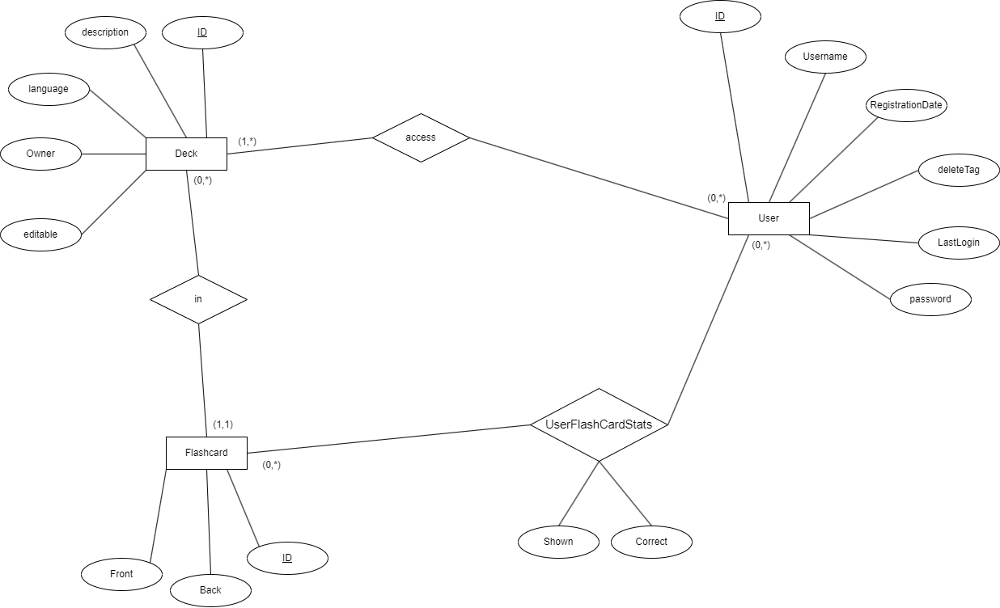

## Datenkatalog

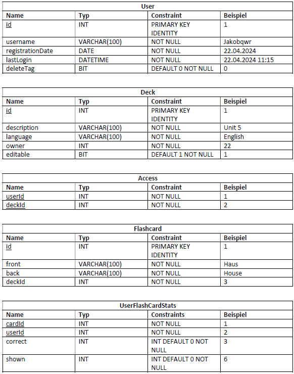

## DDL-Skript
```
DROP SCHEMA IF EXISTS wmc CASCADE;

CREATE SCHEMA wmc;

DROP TABLE IF EXISTS wmc.UserFlashCardStats;
DROP TABLE IF EXISTS wmc.Flashcard;
DROP TABLE IF EXISTS wmc.Access;
DROP TABLE IF EXISTS wmc.Deck;
DROP TABLE IF EXISTS wmc.fcUser;

CREATE TABLE wmc.fcUser (
    id SERIAL PRIMARY KEY,
    username VARCHAR(100) UNIQUE NOT NULL,
    password VARCHAR(255) NOT NULL,
    registrationDate DATE NOT NULL,
    lastLogin TIMESTAMP NOT NULL,
    deleteTag BOOLEAN DEFAULT FALSE NOT NULL
);


CREATE TABLE wmc.Deck (
    id SERIAL PRIMARY KEY,
    description VARCHAR(100) NOT NULL,
    language VARCHAR(100) NOT NULL,
    owner INT NOT NULL,
    editable BOOLEAN DEFAULT TRUE NOT NULL,
    FOREIGN KEY (owner) REFERENCES wmc.fcUser(id) ON DELETE CASCADE
);

CREATE TABLE wmc.Access (
    userId INT,
    deckId INT,
    PRIMARY KEY (userId, deckId),
    FOREIGN KEY (userId) REFERENCES wmc.fcUser(id),
    FOREIGN KEY (deckId) REFERENCES wmc.Deck(id) ON DELETE CASCADE
);

CREATE TABLE wmc.Flashcard (
    id SERIAL PRIMARY KEY,
    front VARCHAR(100) NOT NULL,
    back VARCHAR(100) NOT NULL,
    deckId INT,
    FOREIGN KEY (deckId) REFERENCES wmc.Deck(id) ON DELETE CASCADE
);

CREATE TABLE wmc.UserFlashCardStats (
    shown INT DEFAULT 0 NOT NULL,
    correct INT DEFAULT 0 NOT NULL,
    userId INT,
    cardId INT,
    PRIMARY KEY (userId, cardId),
    FOREIGN KEY (userId) REFERENCES wmc.fcUser(id),
    FOREIGN KEY (cardId) REFERENCES wmc.Flashcard(id) ON DELETE CASCADE
);
```

## Ausschnitte aus den Testdaten

```
INSERT INTO wmc.fcUser (username, password ,registrationDate, lastLogin)
VALUES
    ('user1', ' $2b$10$GnUHqYGKGSyl8s78vIyz3OlX81Zk6Pee7XZX8QNq3vnrbC5NF.MNe', '2024-01-01', '2024-04-28 10:00:00'),
    ('user2', 'hashed', '2024-01-02', '2024-04-28 11:00:00'),
    ('user3', 'hashed', '2024-01-03', '2024-04-28 12:00:00');

INSERT INTO wmc.Deck (description, language, owner, editable) 
VALUES 
    ('UNIT 1', 'English', 1, TRUE), 
    ('Deck 1', 'Deutsch', 2, FALSE), 
    ('UNIT 3', 'English', 3, TRUE);

INSERT INTO wmc.Access (userId, deckId) 
VALUES 
    (1, 1), 
    (1, 2), 
    (2, 2), 
    (3, 3);

INSERT INTO wmc.Flashcard (front, back, deckId) 
VALUES 
    ('Haus', 'house', 1), 
    ('Maus', 'mouse', 1), 
    ('accommodation', 'Unterkunft', 2), 
    ('Tisch', 'table', 3);

INSERT INTO wmc.UserFlashCardStats (shown, correct, userId, cardId) 
VALUES 
    (10, 8, 1, 1), 
    (15, 12, 1, 2), 
    (8, 6, 2, 3), 
    (5, 4, 3, 4);
```